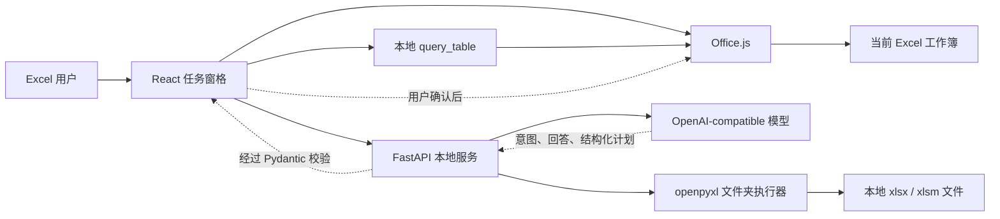
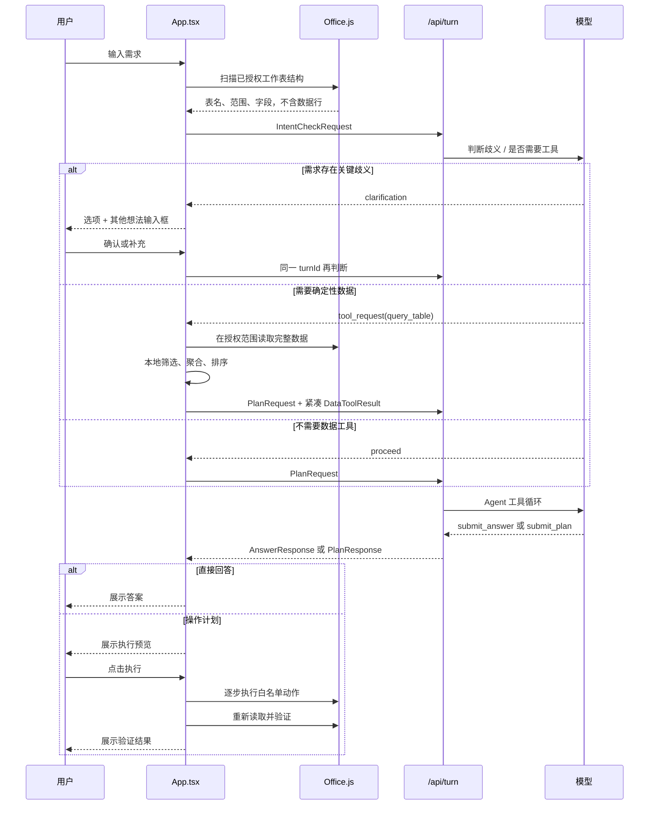

# Excel Bro 架构说明

> 文档状态：与 2026-07-26 的代码一致。  
> 面向对象：首次接手项目的前端、后端、AI Agent 和测试开发者。

## 1. 系统定位

Excel Bro 是一个本地优先的 Excel AI 助手。自然语言模型负责理解意图和生成受约束的操作计划，本地代码负责读取数据、确定性计算、执行 Excel 操作和验证结果。

项目刻意不让模型直接控制 Excel，也不允许模型生成并执行任意脚本。模型可以：

- 判断需求是否存在关键歧义；
- 请求受控的本地数据工具；
- 返回直接回答；
- 生成符合 `AnalysisPlan` 协议的操作计划。

真正的 Excel 写入只能在用户看到计划并点击确认后发生。

## 2. 不可破坏的设计原则

后续开发应优先保持以下边界：

1. **模型判断语义，本地工具计算事实。** 不要在代码里硬编码“影院名称”“影片名称”等业务字段或行业规则。
2. **用户选择的工作表是授权边界。** 模型和工具都不能自行扩大到未选择的工作表。
3. **意图判断阶段不上传数据行。** 只提供工作簿名、工作表名、使用范围、行列数和本地识别的字段。
4. **查询工具本地执行。** `query_table` 在 Excel 端读取完整授权范围并计算，只把紧凑结果返回模型。
5. **写入前必须预览。** 模型返回的写入动作先转成结构化 `AnalysisPlan`，用户确认后才执行。
6. **协议必须双重校验。** Python 使用 Pydantic，TypeScript 也对响应进行运行时断言。
7. **不执行任意代码。** 不开放 VBA、宏、任意 JavaScript、网络脚本或外部程序。
8. **执行后读取真实结果验证。** 不能只相信模型或执行函数返回“成功”。
9. **API Key 只保存在后端环境变量。** 前端只提交服务端允许的模型 ID。
10. **项目级限额统一配置。** 新增读取、会话、工具或 Agent 限额时优先修改 `config/capabilities.json`。

## 3. 总体结构

运行时有两条执行通道：

- **当前工作簿模式**：React 通过 Office.js 读取和写入当前打开的 Excel。
- **文件夹模式**：FastAPI 通过 `openpyxl` 扫描、备份并修改磁盘中的 `.xlsx/.xlsm` 文件。

浏览器打开 `https://localhost:3000` 时使用内置演示工作簿，只用于界面调试，不执行真实写入。

## 4. 一轮对话的数据流

### 4.1 轮次状态与幂等

统一入口是 `POST /api/turn`。同一轮需求的意图判断、澄清、工具修正和最终完成共享 `turnId`。

`server/app/turn_state.py` 保存带 TTL 的内存状态：

- `deciding`
- `awaiting_clarification`
- `awaiting_tool`
- `awaiting_completion`
- `completed`

同一个已完成轮次重复提交相同完成参数时返回缓存结果；参数不同则返回 `TURN_ALREADY_COMPLETED`。这可以避免双击或网络重试造成重复模型调用和重复计划。

`/api/intent` 与 `/api/plan` 是兼容入口，新功能应优先接入 `/api/turn`。

## 5. 前端模块

前端位于 `apps/excel-addin/`，技术栈为 React、TypeScript、Vite 和 Office.js。

| 文件 | 职责 |
| --- | --- |
| `src/main.tsx` | React 入口 |
| `src/App.tsx` | 对话状态机、数据范围、意图循环、工具调用、计划预览、历史、图片和主要 UI |
| `src/api.ts` | FastAPI 客户端、统一错误解析、模型与文件夹接口 |
| `src/contracts.ts` | 前端协议、Excel 动作联合类型、运行时响应断言 |
| `src/excel.ts` | Office.js 快照、动作执行、验收条件推断和结果验证 |
| `src/dataTools.ts` | `query_table` 的字段校验、筛选、聚合、占比、排序和限额 |
| `src/tableSchema.ts` | 在 Excel 本地探测表头和字段 |
| `src/splitAggregate.ts` | `splitGroupAggregate` 的确定性拆分与聚合 |
| `src/storage.ts` | 聊天之外的“我的工具”存储、资格检查、参数化和计划实例化 |
| `src/imageAttachments.ts` | 图片校验、压缩和附件准备 |
| `src/workbookIdentity.ts` | 从文件名提取数据周期等工作簿身份信息 |
| `src/demo.ts` | 浏览器模式演示工作簿 |
| `src/styles.css` | 任务窗格样式 |
| `manifest.xml` | Excel 功能区和任务窗格旁加载清单 |

### 5.1 `App.tsx` 的职责边界

`App.tsx` 当前仍是较大的协调组件。增加新能力时：

- 业务计算应放入独立模块，不要继续堆进组件；
- Office.js 操作放入 `excel.ts`；
- API 调用放入 `api.ts`；
- 可复用的确定性数据处理放入 `dataTools.ts` 或新模块；
- 协议类型与断言放入 `contracts.ts`；
- 组件只负责状态编排和交互。

## 6. 后端模块

后端位于 `server/app/`，技术栈为 FastAPI、Pydantic、HTTPX 和 openpyxl。

| 文件 | 职责 |
| --- | --- |
| `main.py` | FastAPI 应用、路由、CORS 和统一服务错误 |
| `models.py` | 请求、响应、动作、计划、工具和验证的 Pydantic 模型 |
| `llm/config.py` | 模型允许列表、视觉能力、环境变量和连接配置 |
| `llm/client.py` | OpenAI-compatible `/chat/completions` 适配器和鉴权 |
| `llm/errors.py` | 与供应商无关的超时、连接、HTTP 和响应错误 |
| `intent.py` | 模型驱动的需求确认、澄清和 `query_table` 请求生成 |
| `excel_agent.py` | 模型工具循环：读取上下文、找字段、读范围、提交答案或计划 |
| `planner.py` | 模型配置、基础模式、本地明确命令和最终规划入口 |
| `turn_state.py` | `turnId` 状态、并发锁、TTL 和完成结果缓存 |
| `folder_workbooks.py` | 文件夹选择、扫描、快照、备份、openpyxl 执行和验证 |
| `capabilities.py` | 读取共享能力配置 |

### 6.1 模型调用分层

模型调用不是一次提示直接生成 JSON：

1. `llm/` 统一解析模型配置、添加鉴权并规范化网络错误。
2. `intent.py` 先判断歧义，并决定是否申请本地数据工具。
3. 明确查询由前端 `query_table` 确定性计算。
4. `planner.py` 决定使用本地基础能力还是模型 Agent。
5. `excel_agent.py` 允许模型按需调用受控工具：
   - `get_workbook_context`
   - `find_fields`
   - `read_range`
   - `submit_answer`
   - `submit_plan`
6. 最终响应必须通过 Pydantic；无效结构允许一次修复循环。

## 7. 核心协议

前端协议定义在 `apps/excel-addin/src/contracts.ts`，后端镜像定义在 `server/app/models.py`。

当前没有自动代码生成，因此**修改协议时必须同步修改两端**，并同步更新：

- TypeScript 运行时断言；
- Pydantic 模型；
- Office.js 或 openpyxl 执行器；
- 动作说明 `actionLabel`；
- 前后端测试。

重要协议：

- `WorkbookSnapshot`：授权工作簿快照；
- `IntentCheckRequest/Response`：意图、澄清和工具路由；
- `DataToolRequest/Result`：本地确定性查询；
- `PlanRequest`：最终回答或规划上下文；
- `AnalysisPlan`：可预览、可执行、可验证的操作计划；
- `ExcelAction`：允许执行的白名单动作；
- `VerificationCriterion/Report`：执行后验收。

## 8. 数据读取边界

### 8.1 结构快照

意图识别使用 `captureWorkbookStructure`：

- 本地检测字段；
- 不发送原始数据行；
- 受 `snapshot.structureRows` 和 `snapshot.structureColumns` 限制。

### 8.2 规划快照

Agent 可以通过受控工具读取快照中的有限数据，限制由：

- `snapshot.dataRows`
- `snapshot.dataColumns`
- `agent.maxReadRows`
- `agent.maxReadColumns`

共同约束。

### 8.3 完整本地查询

当模型请求 `query_table` 时，前端通过 Office.js 在已授权工作表内读取数据并本地计算。上限位于 `config/capabilities.json` 的 `queryTable` 节点。模型只接收紧凑结果、计算说明、扫描行数和警告。

## 9. Excel 动作执行与验证

`AnalysisPlan.actions` 是唯一允许的写入描述。当前执行器：

- 工作簿模式：`apps/excel-addin/src/excel.ts`
- 文件夹模式：`server/app/folder_workbooks.py`

两条通道的能力并不完全相同。新增动作时不能只实现一端后假定另一端也支持；不支持时必须返回明确错误。

计划执行后：

1. 根据显式 `acceptanceCriteria` 验证；
2. 对旧计划可由确定性规则推断部分验收条件；
3. 重新读取真实单元格或工作表状态；
4. 返回逐项 `VerificationReport`；
5. 只有验证通过的计划才能保存到“我的工具”。

## 10. “我的工具”

“我的工具”不是脚本仓库，而是结构化 `AnalysisPlan` 模板。

`storage.ts` 负责：

- 判断计划能否固化；
- 阻止包含内嵌图片的计划；
- 要求用户确认固定值和破坏性动作；
- 参数化来源工作表、输出工作表、源数据范围和字段；
- 切换来源表时重新读取字段和实际 `usedRange`；
- 运行前检查工作表存在、输出名称冲突和字段有效性；
- 编译出新的计划，再进入正常预览流程；
- 迁移 v1 和早期 v2 工具。

不要让固化工具绕过预览，也不要把任意模型生成脚本接到执行器。

## 11. 本地持久化

前端使用浏览器/Office WebView 的 `localStorage`：

- 对话历史：`excel-bro.chat.v4`
- 旧对话兼容：`excel-bro.chat.v3`
- 当前模型：`excel-bro.model.v2`
- 工具：`excel-bro.tools.v2`
- 旧工具兼容：`excel-bro.tools.v1`

图片只随当前请求发送，不持久化到对话历史。API Key 不进入前端存储。

## 12. 配置与端口

- Vite HTTPS：`https://localhost:3000`
- FastAPI：`http://127.0.0.1:8765`
- 前端可用 `VITE_API_BASE_URL` 覆盖 API 地址
- 后端模型配置：`server/.env`
- 项目能力限额：`config/capabilities.json`

模型服务必须兼容 `/chat/completions`。当前同一后端实例的模型选择共享一个 Base URL 和 API Key，不同模型 ID 由 `AI_MODEL` 和 `AI_MODELS` 声明。

## 13. 扩展能力时改哪里

### 新增一种 Excel 动作

1. 在 `server/app/models.py` 增加 Pydantic 动作并加入联合类型。
2. 在 `apps/excel-addin/src/contracts.ts` 增加对应联合类型和断言。
3. 在 `excel.ts` 实现 Office.js 执行和最低 API 版本。
4. 如需文件夹模式，在 `folder_workbooks.py` 实现或明确拒绝。
5. 增加 `actionLabel`、风险判断、验收条件和固化参数绑定。
6. 补前后端测试。

### 新增一个本地数据工具

1. 在两端协议中定义工具请求和结果。
2. 由模型只决定“何时调用”和结构化参数。
3. 在前端或后端的授权边界内确定性执行。
4. 返回紧凑结果，不回传无关原始数据。
5. 定义稳定错误码、是否可重试和模型最多修正次数。

### 接入新的模型

如果模型与当前服务共享 OpenAI-compatible Base URL 和 Key，只需加入 `AI_MODELS`；支持图片时还需加入 `AI_VISION_MODELS`。

当前 OpenAI-compatible 接入已经集中在 `server/app/llm/`。如果需要不同 Base URL、不同 Key 或 Claude 等非兼容协议，应新增适配器和连接配置，不要把供应商判断重新散落到 UI、`intent.py` 和 `excel_agent.py`。

## 14. 已知技术债

以下不是立即故障，但后续重构时优先关注：

- `App.tsx` 体积较大，适合拆分为对话状态机、范围选择器、消息列表、工具抽屉和输入框组件。
- TypeScript 与 Pydantic 协议手工同步，存在漂移风险；可考虑从 JSON Schema 生成一端类型。
- `TurnRegistry` 是单进程内存状态，不适合多进程或多实例部署。
- 对话和工具保存在 WebView `localStorage`，没有跨设备同步或用户账户隔离。
- 模型配置目前共享单一 Base URL 和 Key，尚未形成多供应商连接配置。
- 工作簿模式和文件夹模式的动作能力需要持续维护一致性矩阵。

## 15. 架构变更的完成标准

涉及架构或协议的改动完成前，至少确认：

- 没有扩大用户的数据授权范围；
- 没有让模型绕过本地工具直接猜测确定性结果；
- 没有让写入绕过预览；
- TypeScript 与 Python 协议同步；
- 当前工作簿与文件夹模式行为已明确；
- 错误是结构化且用户可理解的；
- `config/capabilities.json` 没有被重复硬编码；
- 前后端测试和前端构建通过；
- 本文档和开发指南已同步更新。
