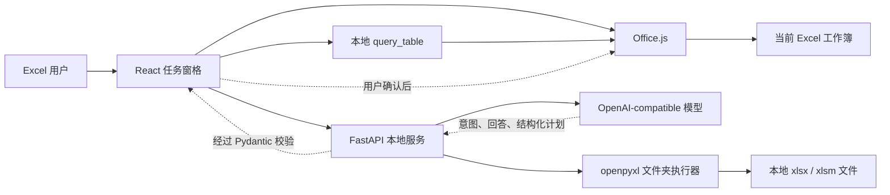
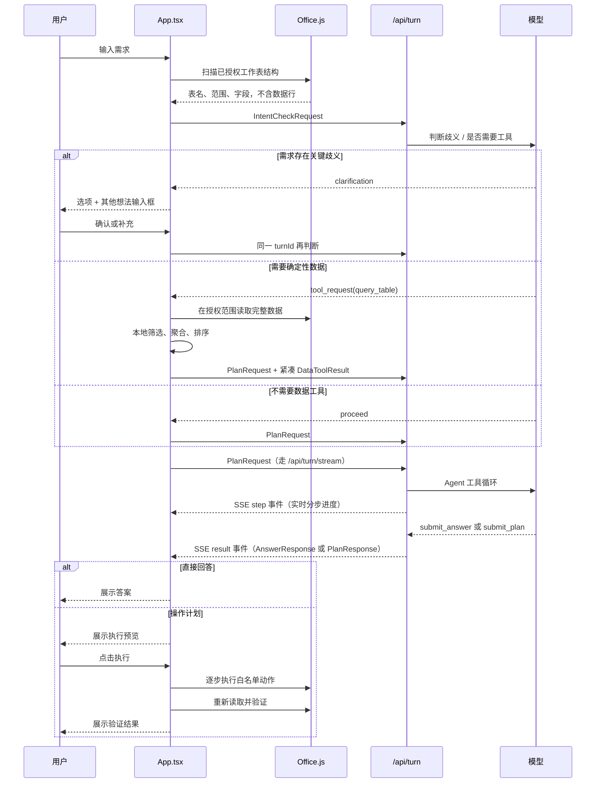

# Excel Bro 架构说明

> 文档状态：与 2026-07-28 的代码一致。
> 面向对象：首次接手项目的前端、后端、AI Agent 和测试开发者。

数据读取、批处理、执行恢复、验收和固化工具的后续优化任务统一记录在
[数据流程优化开发计划](./DATA_PIPELINE_OPTIMIZATION_PLAN.md)。

## 1. 系统定位

Excel Bro 是一个本地优先的 Excel AI 助手。自然语言模型负责理解意图和生成受约束的操作计划，本地代码负责读取数据、确定性计算、执行 Excel 操作和验证结果。

项目刻意不让模型直接控制 Excel，也不允许模型生成并执行任意脚本。模型可以：

- 判断需求是否存在关键歧义；
- 请求受控的本地数据工具；
- 返回直接回答；
- 生成符合 `AnalysisPlan` 协议的操作计划。

真正的 Excel 写入只能在用户看到计划并点击确认后发生。

## 2. 不可破坏的设计原则

后续开发应优先保持以下边界：

1. **模型判断语义，本地工具计算事实。** 不要在代码里硬编码“影院名称”“影片名称”等业务字段或行业规则。
2. **用户选择的工作表是授权边界。** 模型和工具都不能自行扩大到未选择的工作表。
3. **意图判断阶段不上传数据行。** 只提供工作簿名、工作表名、使用范围、行列数和本地识别的字段。
4. **查询工具本地执行。** `query_table` 在 Excel 端读取完整授权范围并计算，只把紧凑结果返回模型。
5. **写入前必须预览。** 模型返回的写入动作先转成结构化 `AnalysisPlan`，用户确认后才执行。
6. **协议必须双重校验。** Python 使用 Pydantic，TypeScript 也对响应进行运行时断言。
7. **不执行任意代码。** 不开放 VBA、宏、任意 JavaScript、网络脚本或外部程序。
8. **执行后读取真实结果验证。** 不能只相信模型或执行函数返回“成功”。
9. **API Key 只保存在本机后端配置。** 任务窗格可以提交新 Key，但完整值不会从后端读回，也不会进入前端持久化；模型请求仍只提交服务端允许的模型 ID。
10. **项目级限额统一配置。** 新增读取、会话、工具或 Agent 限额时优先修改 `config/capabilities.json`。

## 3. 总体结构

运行时有两条执行通道：

- **当前工作簿模式**：React 通过 Office.js 读取和写入当前打开的 Excel。
- **文件夹模式**：FastAPI 通过 `openpyxl` 扫描、备份并修改磁盘中的 `.xlsx/.xlsm` 文件。

浏览器打开 `https://localhost:3000` 时使用内置演示工作簿，只用于界面调试，不执行真实写入。

## 4. 一轮对话的数据流

### 4.1 轮次状态与幂等

统一入口是 `POST /api/turn`。同一轮需求的意图判断、澄清、工具修正和最终完成共享 `turnId`。

`server/app/turn_state.py` 保存带 TTL 的内存状态：

- `deciding`
- `awaiting_clarification`
- `awaiting_tool`
- `awaiting_completion`
- `completed`

同一个已完成轮次重复提交相同完成参数时返回缓存结果；参数不同则返回 `TURN_ALREADY_COMPLETED`。这可以避免双击或网络重试造成重复模型调用和重复计划。

`/api/intent` 与 `/api/plan` 是兼容入口，新功能应优先接入 `/api/turn`。

### 4.2 流式分步进度与失败不浪费

规划请求默认走 `POST /api/turn/stream`（SSE，`text/event-stream`），意图判断仍走 `/api/turn`（很快，不流式）。三条协同机制确保「不糟蹋用户已经等掉的时间」：

- **step 事件**：Agent 循环把「理解需求 / 规划操作 / 查看工作簿 / 查找字段「x」/ 读取 sheet!range」等分步动作实时推给前端 `advanceActivity`，界面不再只是冻结文案 + 秒表。字段对齐 `advanceActivity(title, detail, completedStep?)`。
- **error 事件**：SSE 已返回 200，模型错误序列化为流内 `error` 事件，镜像 `service_error` 的 `{code, message, retryable}` 并附 `status`。前端 `streamAssistantResponse` 收到 `error` 抛 `ApiRequestError`；旧后端 404/405 或收到事件前的网络错误则降级回退 `createAssistantResponse`。
- **工具结果缓存**：只读工具（`get_workbook_context`/`find_fields`/`read_range`）对同一份快照是确定性计算，结果按 `(name, sorted-args)` 缓存在 `TurnState.tool_cache`（按 `turnId` 存活）。上游 429/5xx 或超时触发重试时，模型仍从第 1 轮重新决策，但每步查数据近乎瞬时返回，避免重复模型往返与 Office.js 读取。

上游过载/限流不再一次就废掉整轮：`server/app/llm/client.py` 的 `chat_completions` 外层对 429/5xx、超时和网络抖动做指数退避重试（尊重 `Retry-After` 数值头），`LLMResponseError` 与 4xx 非 429（如 401）不重试。

## 5. 前端模块

前端位于 `apps/excel-addin/`，技术栈为 React、TypeScript、Vite 和 Office.js。

| 文件 | 职责 |
| --- | --- |
| `src/main.tsx` | React 入口 |
| `src/App.tsx` | 对话状态机、数据范围、意图循环、工具调用、计划预览、历史、图片和主要 UI |
| `src/api.ts` | FastAPI 客户端、统一错误解析、模型与文件夹接口 |
| `src/contracts.ts` | 前端协议、Excel 动作联合类型、运行时响应断言 |
| `src/excel.ts` | Office.js 快照、动作执行、验收条件推断和结果验证 |
| `src/dataTools.ts` | `query_table` 的字段校验、筛选、聚合、占比、排序和限额 |
| `src/tableSchema.ts` | 在 Excel 本地探测表头和字段 |
| `src/splitAggregate.ts` | `splitGroupAggregate` 的确定性拆分与聚合 |
| `src/storage.ts` | 聊天之外的“我的工具”存储、资格检查、参数化和计划实例化 |
| `src/imageAttachments.ts` | 图片校验、压缩和附件准备 |
| `src/workbookIdentity.ts` | 从文件名提取数据周期等工作簿身份信息 |
| `src/demo.ts` | 浏览器模式演示工作簿 |
| `src/styles.css` | 任务窗格样式、Fluent 语义字号和响应式布局 |
| `src/focusState.ts` | 任务窗格与专注窗口共享的只读展示快照类型 |
| `src/FocusWorkspace.tsx` | 专注窗口的只读对话与工具浏览界面 |
| `src/focus.tsx` / `focus.html` / `src/focus.css` | Office Dialog 独立入口与专注窗口样式 |
| `manifest.xml` | Excel 功能区和任务窗格旁加载清单 |

### 5.1 `App.tsx` 的职责边界

`App.tsx` 当前仍是较大的协调组件。增加新能力时：

- 业务计算应放入独立模块，不要继续堆进组件；
- Office.js 操作放入 `excel.ts`；
- API 调用放入 `api.ts`；
- 可复用的确定性数据处理放入 `dataTools.ts` 或新模块；
- 协议类型与断言放入 `contracts.ts`；
- 组件只负责状态编排和交互。

### 5.2 排版与窗口层级

任务窗格使用 Office/Fluent 兼容的语义字号，而不是按组件任意缩放：正文
`14/20px`、说明文字 `12/16px`、小标题 `16/22px`、标题 `20/26px`、页面标题
`24/32px`。基础字体优先使用 `Segoe UI Variable Text`、`Segoe UI`，并提供
Microsoft YaHei UI、Microsoft YaHei 和 PingFang SC 等中文回退。正常界面文字
不得小于 12px。

顶部“显示方式”入口提供三种阅读空间：

- 标准任务窗格：默认宽度，保留完整 Excel 工作区；
- 加宽任务窗格：通过 `TaskPaneApi 1.1` 在宿主允许范围内切换宽度；
- 专注窗口：通过 Office Dialog 打开约 90% 的独立只读窗口，用于查看长对话、
  计划结果和工具说明。

Office Dialog 是独立运行时，不能直接执行 Office.js 工作簿操作。任务窗格只向
专注窗口发送当前界面的有限展示快照；执行、写入、预览和用户确认仍全部留在
任务窗格。支持 `DialogApi 1.2` 时使用 `messageChild` 传递快照，旧宿主使用
同源 `localStorage` 作为只读启动快照回退。

## 6. 后端模块

后端位于 `server/app/`，技术栈为 FastAPI、Pydantic、HTTPX 和 openpyxl。

| 文件 | 职责 |
| --- | --- |
| `main.py` | FastAPI 应用、路由、CORS 和统一服务错误 |
| `models.py` | 请求、响应、动作、计划、工具和验证的 Pydantic 模型 |
| `llm/config.py` | 模型允许列表、视觉能力、环境变量、Key 持久化和连接配置 |
| `llm/client.py` | OpenAI-compatible `/chat/completions` 适配器、鉴权和 429/5xx/超时的指数退避重试 |
| `llm/errors.py` | 与供应商无关的超时、连接、HTTP 和响应错误 |
| `intent.py` | 模型驱动的需求确认、澄清和 `query_table` 请求生成 |
| `excel_agent.py` | 模型工具循环：读取上下文、找字段、读范围、提交答案或计划 |
| `planner.py` | 模型配置、基础模式、本地明确命令和最终规划入口 |
| `turn_state.py` | `turnId` 状态、并发锁、TTL 和完成结果缓存 |
| `folder_workbooks.py` | 文件夹选择、扫描、快照、备份、openpyxl 执行和验证 |
| `capabilities.py` | 读取共享能力配置 |

### 6.1 模型调用分层

模型调用不是一次提示直接生成 JSON：

1. `llm/` 统一解析模型配置、添加鉴权并规范化网络错误。
2. `intent.py` 先判断歧义，并决定是否申请本地数据工具。
3. 明确查询由前端 `query_table` 确定性计算。
4. `planner.py` 决定使用本地基础能力还是模型 Agent。
5. `excel_agent.py` 允许模型按需调用受控工具：
   - `get_workbook_context`
   - `find_fields`
   - `read_range`
   - `submit_answer`
   - `submit_plan`
6. 最终响应必须通过 Pydantic；无效结构允许一次修复循环。

`client.py` 的 `chat_completions` 对可重试错误（429/5xx、超时、网络抖动）做指数退避重试，参数来自 `config/capabilities.json` 的 `llm` 节点（`maxRetries`/`retryBaseDelaySeconds`/`retryMaxDelaySeconds`）；`excel_agent.py` 的只读工具结果缓存在 `TurnState.tool_cache`，重试时确定性读取近乎瞬时返回。`run_excel_agent` 支持 `on_event` 回调，供 `/api/turn/stream` 推送分步进度。

为缩短真实耗时、降低长耗时被中断的概率：

- **数据已在手时精简工具集。** 当 `PlanRequest.dataResults` 非空（前端 `query_table` 已确定性算好结果），`run_excel_agent` 使用 `AGENT_TOOLS_WITH_DATA`（仅 `submit_answer` + `submit_plan`），去掉 `get_workbook_context`/`find_fields`/`read_range` 三个只读工具。既减少每轮携带的 token，也避免模型多绕几轮重复读取；写入意图仍保留 `submit_plan`，无损。
- **模型超时统一配置。** 超时默认来自 `llm.timeoutSeconds`，经 `capabilities.model_timeout_seconds()` 读取；环境变量 `AI_TIMEOUT_SECONDS` 为正数时优先，非法/非正值回退配置默认，绝不让坏值中断请求。意图阶段在此基础上再夹在 10~60 秒。

## 7. 核心协议

前端协议定义在 `apps/excel-addin/src/contracts.ts`，后端镜像定义在 `server/app/models.py`。

当前没有自动代码生成，因此**修改协议时必须同步修改两端**，并同步更新：

- TypeScript 运行时断言；
- Pydantic 模型；
- Office.js 或 openpyxl 执行器；
- 动作说明 `actionLabel`；
- 前后端测试。

重要协议：

- `WorkbookSnapshot`：授权工作簿快照；
- `IntentCheckRequest/Response`：意图、澄清和工具路由；
- `DataToolRequest/Result`：本地确定性查询；
- `PlanRequest`：最终回答或规划上下文；
- `AnalysisPlan`：可预览、可执行、可验证的操作计划；
- `ExcelAction`：允许执行的白名单动作；
- `VerificationCriterion/Report`：执行后验收。
- `ModelSettingsResponse/UpdateModelSettingsRequest/UpsertModelConnectionRequest`：只读掩码状态、旧环境配置 Key 更新和独立模型连接增删改。
- `TurnStepEvent`：`/api/turn/stream` 的分步进度事件（`phase`/`title`/`detail`/`completedStep`），对齐前端 `advanceActivity`。

## 8. 数据读取边界

### 8.1 结构快照

意图识别使用 `captureWorkbookStructure`：

- 本地检测字段；
- 不发送原始数据行；
- 受 `snapshot.structureRows` 和 `snapshot.structureColumns` 限制。

### 8.2 规划快照

Agent 可以通过受控工具读取快照中的有限数据，限制由：

- `snapshot.dataRows`
- `snapshot.dataColumns`
- `agent.maxReadRows`
- `agent.maxReadColumns`

共同约束。

### 8.3 完整本地查询

当模型请求 `query_table` 时，当前工作簿通过 Office.js 在已授权工作表内分块读取并由增量累加器直接计算，不在浏览器内重新拼接完整数据矩阵；文件夹模式通过 `folder_data.py` 的受控 pandas 适配层读取会话中已授权的稳定文件 ID 和工作表 ID，并按 Excel 数字格式保留前导零编码。文件夹查询支持 union、按字段去重、结构化 join 和分组，不接受代码字符串或任意路径。两种模式都在读取前或合并后执行行、列、单元格上限检查，上限位于 `config/capabilities.json` 的 `queryTable` 节点。模型只接收紧凑结果、计算说明、扫描行数和警告。

## 9. Excel 动作执行与验证

`AnalysisPlan.actions` 是唯一允许的写入描述。当前执行器：

- 工作簿模式：`apps/excel-addin/src/excel.ts`
- 文件夹模式：`server/app/folder_workbooks.py`

两条通道的能力并不完全相同。新增动作时不能只实现一端后假定另一端也支持；不支持时必须返回明确错误。

计划执行前后：

1. 先预检整份计划的工作表依赖、动作顺序、区域地址、写入矩阵尺寸、表格/透视表/命名区域/具名图片冲突和 Office.js API 版本，文件夹模式也在打开可写工作簿前预检；
2. 预检通过后才执行动作；
3. 根据显式 `acceptanceCriteria` 验证；
4. 对旧计划可由确定性规则推断部分验收条件；当前可推断工作表、值、
   公式、清空、排序、筛选、清除筛选、表格、常用格式、边框、数据验证
   和冻结窗格条件；数据透视表也会自动获得对象验收条件，图表名称则在
   Office.js 创建对象后加入动态验收条件；
5. 重新读取真实单元格或工作表状态；
6. 返回逐项 `VerificationReport`，总体状态分为 `verified`、`executed_unverified` 和 `failed`；
7. “工作表存在”只验证工作表本身，不能替代格式、筛选、图表、透视表等复杂动作的效果验证；缺少对应验收能力时列出 `unverifiedActions`；
8. 若执行中途失败，工作簿模式返回 `succeeded`、`failed` 和 `not_run` 动作明细，避免把部分写入误报成整体失败；
9. 只有状态为 `verified` 的计划才能保存到“我的工具”。
10. 一次性计划携带预览时的数据来源内容指纹；Office.js 对全部授权来源单元格分块计算完整指纹，执行前不一致会拒绝写入。当前工作簿中的固化工具使用结构兼容指纹，只要求授权来源工作表和工具实际依赖的字段仍存在；行数、数据值、使用范围、表格位置、字段顺序以及无关字段变化不会让工具失效。文件夹计划仍必须携带会话预览内容指纹。
11. 文件夹模式把所有修改先保存为同目录临时文件，全部成功后才备份并替换目标。
12. Office.js 的值、公式、仅清空内容、填充和字体等可恢复动作记录本次执行前快照；任务窗格提供一次性的“撤销”入口。无法完整恢复的清空格式等动作不会误标为可撤销。

`splitGroupAggregate` 会先在本地一次扫描中完成拆分和聚合，再按
`config/capabilities.json` 的 `excelExecution.splitAggregateBatchSheets`
批量创建、写入和格式化结果表。默认每 25 张结果表同步一次 Office.js，
避免逐表 `context.sync()` 的往返开销，同时限制单次提交规模；覆盖已有结果表
时，批次会先统一读取待清空区域，再提交写入。任一批次失败后仍会尽力删除
本轮新建的结果表。

排序验收读取执行后的完整目标范围，并按多关键字和方向检查真实值顺序；
筛选验收读取 AutoFilter 的范围、列和值条件；表格验收读取真实表格名称、
范围和表头状态。文件夹模式在保存后重新打开文件执行同类检查。若写入后又
对同一区域排序，自动验收只检查最终状态，不保留已经失效的中间值快照。

格式验收覆盖填充色、字体粗体/颜色、数字格式、对齐、自动换行、行高、
列宽和边框；数据验证验收覆盖规则类型、公式/列表、运算符、空值策略及
已提供的提示文本；冻结窗格验收读取实际冻结位置。相同范围或工作表上的
后续动作会覆盖先前属性时，只验收最终仍可观察的状态。条件格式等暂时无法
跨 Office.js 与 openpyxl 稳定对齐的属性继续列入 `unverifiedActions`。

当前工作簿的图表验收会读取执行后生成的真实名称、图表类型、标题和位置，
并通过系列维度值与源区域数据核对数据源；因此 `createChart` 要求 ExcelApi
1.12。数据透视表验收会读取对象名称、数据源字符串、布局起始位置、行列字段
和聚合字段，因此 `createPivotTable` 要求 ExcelApi 1.15。文件夹模式仍只对
openpyxl 能稳定读取的对象提供强验收：图表保持 `executed_unverified`，
数据透视表在执行前明确拒绝。

## 10. “我的工具”

“我的工具”不是脚本仓库，而是结构化 `AnalysisPlan` 模板。

`storage.ts` 负责：

- 判断计划能否固化；
- 阻止包含内嵌图片的计划；
- 要求用户确认固定值和破坏性动作；
- 参数化来源工作表、输出工作表、源数据范围和字段；
- 切换来源表时重新读取字段和实际 `usedRange`；
- 当前工作簿运行时按所需字段做结构兼容检查，不锁死保存时的行数、数据值、
  使用范围或字段位置；
- 运行前检查工作表存在、输出名称冲突和字段有效性；
- 编译出新的计划，再进入正常预览流程；
- 迁移 v1 和早期 v2 工具。

确定性查询另存为 `DeterministicQueryTemplate`，保存 `DataToolRequest`、
来源工作表名称/稳定 ID 和预期输出表头。稳定 ID 由文件夹相对路径和工作表名确定，
重新扫描不会随机变化；运行时必须同时匹配名称与 ID。当前工作簿调用 `dataTools.ts`，
文件夹调用 pandas 查询端点；两者都绕过意图和规划模型。字段缺失、来源模式
变化或输出结构变化时，本地执行器停止并要求用户决定是否重新调用模型。

不要让固化工具绕过预览，也不要把任意模型生成脚本接到执行器。

## 11. 本地持久化

前端使用浏览器/Office WebView 的 `localStorage`：

- 对话历史：`excel-bro.chat.v4`
- 旧对话兼容：`excel-bro.chat.v3`
- 当前模型：`excel-bro.model.v2`
- 宠物显示偏好：`excel-bro.pet.visibility.v1`
- 工具：`excel-bro.tools.v2`
- 固化查询：`excel-bro.query-tools.v1`
- 旧工具兼容：`excel-bro.tools.v1`
- 专注窗口临时快照：`excel-bro.focus.v1`

专注窗口快照只包含界面已经展示的对话、计划结果和工具说明，不提供写入能力。
图片只随当前请求发送，不持久化到对话历史。API Key 不进入前端存储；设置页的输入值只保存在当前组件内存中，保存或关闭后即清空。

前端 `diagnostics.ts` 只记录阶段、耗时、扫描行数、状态、错误分类和模型调用
次数；设置页可导出 JSON。后端 `/api/diagnostics` 记录本地 API 路径、状态码
和耗时。两类诊断都不记录 API Key、提示词或原始数据行。

## 12. 配置与端口

- Vite HTTPS：`https://localhost:3000`
- FastAPI：`http://127.0.0.1:8765`
- 前端可用 `VITE_API_BASE_URL` 覆盖 API 地址
- 后端模型配置：`server/.env`
- 安装包模式的用户配置：Windows 为 `%LOCALAPPDATA%\Excel Bro`，macOS 为
  `~/Library/Application Support/Excel Bro`
- Windows 安装包程序目录：`%LOCALAPPDATA%\Programs\Excel Bro`
- macOS 安装包程序目录：`/Applications/Excel Bro`
- 个人 Windows 安装的清单共享：`\\<电脑名>\ExcelBroAddins`
- macOS 旁加载目录：`~/Library/Containers/com.microsoft.Excel/Data/Documents/wef`
- 独立模型连接：环境配置文件同目录下的 `model-connections.json`
- 项目能力限额：`config/capabilities.json`（含 `agent` 与 `llm` 节点；`llm.maxRetries`/`llm.retryBaseDelaySeconds`/`llm.retryMaxDelaySeconds` 控制退避重试，`llm.timeoutSeconds` 控制模型请求超时，可被 env `AI_TIMEOUT_SECONDS` 覆盖）

主要 API 端点：

- `POST /api/turn`：统一轮次入口（意图判断、澄清、工具修正、最终完成），非流式。
- `POST /api/turn/stream`：规划请求的 SSE 流式版本，实时推送 `step`/`result`/`error` 事件；仅接受 plan 请求，意图判断仍走 `/api/turn`。前端在旧后端 404/405 或早期网络错误时自动降级回退 `/api/turn`。
- `POST /api/intent`、`POST /api/plan`：兼容入口，新功能优先接入 `/api/turn`。
- `GET /api/diagnostics`、`GET /api/capabilities`、`GET /health`、模型设置与文件夹相关端点见对应章节。

个人 Windows 安装包使用实际 Windows 计算机名创建一个仅包含
`manifest.xml`、只授予当前用户读取权限的本机 SMB 共享，并将其写入
`HKCU\Software\Microsoft\Office\16.0\Wef\TrustedCatalogs`。用户首次在 Excel
的“共享文件夹”中确认添加后，功能区可用于普通工作簿。`Wef\Developer` 注册只
为包含 WebExtension 引用的旁加载测试文档提供清单查找，不能把未发布加载项全局
安装到所有普通工作簿。创建和删除 SMB 共享需要 UAC 管理员授权；卸载器同时删除
可信目录注册和共享，但保留用户模型配置。

外层安装生命周期由 Inno Setup 管理，而不是由 PyInstaller 自解压程序模拟。
PyInstaller 只冻结本地 FastAPI 服务。Inno Setup 提供可选安装目录、开始菜单、
安装确认、进度、标准卸载确认和 Windows“已安装的应用”注册。安装与卸载都以
当前用户模式运行，仅 SMB 共享操作通过受控 PowerShell 子进程请求 UAC；因此
HKCU、证书和 `%LOCALAPPDATA%` 始终属于发起安装的用户。卸载共享失败会在 Inno
删除文件和注册项之前中止，避免再次产生“卸载入口消失但程序仍在”的半卸载状态。

macOS 安装包由 `.github/workflows/build-mac.yml` 在 GitHub Actions 构建（
x86_64 与 arm64 两个 `.pkg`），本机有 Mac 时也可运行 `packaging/build_mac.sh`。
`.pkg` 的 preinstall/postinstall 脚本以 root 运行，承担 Windows 上
`install_tasks.ps1` 的职责：清单直接拷入 Mac Excel 容器内的 `wef` 旁加载目录
（以桌面用户身份写入），`localhost` 证书信任到系统钥匙串，自启动使用
LaunchAgent `com.excelbro.runtime`，安装末尾健康检查失败会回滚。卸载使用安装
目录内的 `uninstall.sh`，同样保留用户模型配置。安装包未做 Apple 签名公证，
适合个人与小范围使用。

模型服务必须兼容 `/chat/completions`。新安装不预置任何供应商或模型，前端在模型目录只有基础模式时显示首次添加引导；顶部统一菜单承担模型选择、添加和管理。旧环境变量配置仍可通过 `AI_MODEL` 和 `AI_MODELS` 让多个模型共享一个 Base URL 和 Key；任务窗格还可以创建多个独立模型连接，每个连接拥有自己的名称、Base URL、模型 ID、API Key 和视觉能力标记。模型目录使用服务端生成的连接 ID，真正发送给供应商的仍是连接内的模型 ID。

任务窗格通过 `GET /api/settings/model` 读取环境配置和独立连接的掩码状态，通过 `PUT /api/settings/model` 更新旧环境配置的 Key，并通过 `POST/DELETE /api/settings/model/connections` 管理独立连接。`POST /api/settings/model/connections/test` 会用表单中的参数发送一个极小的 `/chat/completions` 请求，但不会先保存连接。新增连接成功后前端自动切换到该模型；编辑时空 Key 表示保留，只有显式勾选清除才会删除旧 Key。相同服务地址和模型 ID 的重复连接会被拒绝，损坏的连接配置文件会返回明确错误而不会被空配置覆盖。后端将完整 Key 写入本机配置，响应、健康检查和模型目录都不会返回完整值。服务仍只监听 `127.0.0.1`，CORS 仅允许本地任务窗格来源。

## 13. 扩展能力时改哪里

### 新增一种 Excel 动作

1. 在 `server/app/models.py` 增加 Pydantic 动作并加入联合类型。
2. 在 `apps/excel-addin/src/contracts.ts` 增加对应联合类型和断言。
3. 在 `excel.ts` 实现 Office.js 执行和最低 API 版本。
4. 如需文件夹模式，在 `folder_workbooks.py` 实现或明确拒绝。
5. 增加 `actionLabel`、风险判断、验收条件和固化参数绑定。
6. 补前后端测试。

### 新增一个本地数据工具

1. 在两端协议中定义工具请求和结果。
2. 由模型只决定“何时调用”和结构化参数。
3. 在前端或后端的授权边界内确定性执行。
4. 返回紧凑结果，不回传无关原始数据。
5. 定义稳定错误码、是否可重试和模型最多修正次数。

### 接入新的模型

如果模型与当前环境配置共享 OpenAI-compatible Base URL 和 Key，只需加入 `AI_MODELS`；支持图片时还需加入 `AI_VISION_MODELS`。如果模型使用不同 Base URL 或 Key，可直接在任务窗格中新增独立模型连接。

当前 OpenAI-compatible 接入和多连接路由已经集中在 `server/app/llm/`。如果需要 Claude 等非兼容协议，应新增适配器，不要把供应商判断重新散落到 UI、`intent.py` 和 `excel_agent.py`。

## 14. 已知技术债

以下不是立即故障，但后续重构时优先关注：

- `App.tsx` 体积较大，适合拆分为对话状态机、范围选择器、消息列表、工具抽屉和输入框组件。
- TypeScript 与 Pydantic 协议手工同步，存在漂移风险；可考虑从 JSON Schema 生成一端类型。
- `TurnRegistry` 是单进程内存状态，不适合多进程或多实例部署。
- 对话和工具保存在 WebView `localStorage`，没有跨设备同步或用户账户隔离。
- 工作簿模式和文件夹模式的动作能力需要持续维护一致性矩阵。

## 15. 架构变更的完成标准

涉及架构或协议的改动完成前，至少确认：

- 没有扩大用户的数据授权范围；
- 没有让模型绕过本地工具直接猜测确定性结果；
- 没有让写入绕过预览；
- TypeScript 与 Python 协议同步；
- 当前工作簿与文件夹模式行为已明确；
- 错误是结构化且用户可理解的；
- `config/capabilities.json` 没有被重复硬编码；
- 前后端测试和前端构建通过；
- 本文档和开发指南已同步更新。
